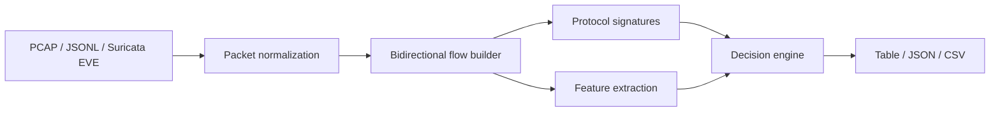

# CryptoFlow Agent


**Find encrypted traffic fast. Explain why it was flagged. Integrate it anywhere.**

CryptoFlow Agent is a lightweight, defensive Python agent for encrypted traffic detection and protocol identification. Feed it PCAP, JSONL packet summaries, or Suricata EVE JSONL, and it turns raw network events into explainable flow-level labels such as `tls`, `quic`, `ssh`, `tls-like`, or `unknown-encrypted`.

It is built for blue teams, SOC labs, traffic research, network inventory, and security data pipelines that need quick answers without decrypting traffic.

```text
encrypted  protocol           confidence flow
---------------------------------------------
True       tls                0.95       TCP 10.0.0.2:53120 <-> 93.184.216.34:443
  - TLS record header observed
  - well-known TLS port observed
False      unknown            0.00       TCP 10.0.0.4:52000 <-> 10.0.0.5:80
  - no encrypted protocol signature or strong entropy signal observed
```

> **Defensive scope:** CryptoFlow Agent does not decrypt traffic, bypass encryption, steal secrets, or perform exploitation. It only classifies and explains observable traffic metadata and payload signatures from networks or captures you are authorized to inspect.

## Why CryptoFlow Agent?

Encrypted traffic is now the default, but defenders still need to answer basic operational questions:

- Which flows are probably encrypted?
- Is this TLS, QUIC, SSH, or something unknown?
- Why was a flow flagged?
- Can I send the result to another pipeline as JSON or CSV?
- Can I run it without standing up a heavy packet-analysis stack?

CryptoFlow Agent focuses on those questions with a small, auditable codebase and explainable outputs.

## Highlights

- **Protocol identification:** TLS, QUIC, SSH, and port-based `*-like` fallbacks.
- **Explainable detection:** every result includes reasons, confidence, and rich flow features.
- **TLS ClientHello metadata:** extracts SNI, ALPN, client version, and supported versions when present.
- **Multiple inputs:** classic PCAP, simple JSONL, and Suricata EVE JSONL.
- **Pipeline-friendly outputs:** table, JSON, or CSV.
- **No mandatory runtime dependencies:** the core agent runs with the Python standard library.
- **CI and weekly maintenance:** tests, lint, smoke checks, and Dependabot are already configured.

## What it can detect today

| Signal | What CryptoFlow Agent uses |
| --- | --- |
| TLS | TLS record headers, common TLS ports, optional ClientHello metadata |
| QUIC | UDP long-header shape and common QUIC ports |
| SSH | SSH banners and common SSH ports |
| Unknown encrypted | entropy, printable ratio, timing, directionality, and payload-size heuristics |
| Plain or unknown | conservative fallback when no strong encrypted signal is present |

## Install

From GitHub:

```bash
python -m pip install git+https://github.com/koppx/cryptoflow-agent.git
```

For local development:

```bash
git clone https://github.com/koppx/cryptoflow-agent.git
cd cryptoflow-agent
python -m pip install -e '.[dev]'
```

## Quick start

Run against the bundled JSONL example:

```bash
cryptoflow-agent examples/sample_packets.jsonl --format jsonl
```

Get structured JSON:

```bash
cryptoflow-agent examples/sample_packets.jsonl --format jsonl --output json
```

Filter to high-confidence encrypted flows:

```bash
cryptoflow-agent examples/sample_packets.jsonl \
  --format jsonl \
  --only-encrypted \
  --min-confidence 0.8
```

Read from stdin:

```bash
cat examples/sample_packets.jsonl | cryptoflow-agent - --format jsonl
```

## Input formats

### 1. PCAP

```bash
cryptoflow-agent traffic.pcap --output json
```

The built-in parser currently supports classic PCAP with Ethernet/IPv4 TCP and UDP packets.

### 2. JSONL packet summaries

Each line is one packet-like event:

```json
{"timestamp": 1.0, "src_ip": "10.0.0.2", "src_port": 53120, "dst_ip": "93.184.216.34", "dst_port": 443, "protocol": "TCP", "payload_encoding": "hex", "payload": "160303002e0100"}
```

Fields:

- `timestamp`: seconds as float or int
- `src_ip`, `src_port`, `dst_ip`, `dst_port`
- `protocol`: `TCP` or `UDP`
- `payload`: text by default, or hex when `payload_encoding` is `hex`
- `size`: optional on-wire packet size

### 3. Suricata EVE JSONL

```bash
cryptoflow-agent examples/sample_eve.jsonl --format eve --output json
```

When EVE events include `payload` or `payload_printable`, CryptoFlow Agent uses those bytes for protocol signatures. If payload bytes are absent, it falls back to ports and flow metadata.


## Flow features

CryptoFlow Agent now extracts a broader feature set for detection, triage, and downstream analytics:

- **Volume:** packet count, byte count, payload bytes, payload packet ratio.
- **Packet sizes:** min, max, mean, standard deviation, p25, p50, p75, coefficient of variation.
- **Timing:** duration, inter-arrival min/max/mean/stddev/CV, bytes per second, packets per second.
- **Directionality:** forward/reverse packet and byte counts, forward ratios, byte asymmetry, packet asymmetry, direction changes.
- **Endpoint context:** source/destination port class, private/global IP flags, IPv4/IPv6 flags, parse-error flags.
- **Payload shape:** entropy and printable byte ratio.

## Output formats

### Table

```bash
cryptoflow-agent examples/sample_packets.jsonl --format jsonl --output table
```

### JSON

```bash
cryptoflow-agent examples/sample_packets.jsonl --format jsonl --output json
```

### CSV

```bash
cryptoflow-agent examples/sample_packets.jsonl --format jsonl --output csv
```

CSV is useful for notebooks, SIEM ingestion tests, and dashboards.

## Python API

```python
from cryptoflow_agent import CryptoFlowAgent, Packet

packets = [
    Packet(
        timestamp=1.0,
        src_ip="10.0.0.2",
        src_port=53000,
        dst_ip="93.184.216.34",
        dst_port=443,
        protocol="TCP",
        payload=b"\x16\x03\x03\x00\x2e" + b"x" * 80,
    )
]

agent = CryptoFlowAgent()
for result in agent.analyze_packets(packets):
    print(agent.explain(result))
```

## How it works



CryptoFlow Agent combines two layers:

1. **Deterministic signatures** for recognizable protocol shapes such as TLS records, QUIC long headers, and SSH banners.
2. **Explainable heuristics** for unknown encrypted-looking traffic using entropy, printable byte ratio, timing, directionality, port class, IP scope, packet count, and size statistics.

The goal is not to be magical; the goal is to be useful, transparent, and easy to extend.

## Example JSON result

```json
{
  "encrypted": true,
  "protocol": "tls",
  "confidence": 0.95,
  "reasons": [
    "TLS record header observed",
    "well-known TLS port observed"
  ],
  "features": {
    "packet_count": 2.0,
    "payload_entropy": 2.1327,
    "printable_ratio": 0.0312,
    "forward_packet_ratio": 0.5,
    "byte_asymmetry": 0.0,
    "direction_changes": 1.0
  }
}
```

When a TLS ClientHello is available, `features.tls` may also include values such as `sni`, `alpn`, and `supported_versions`.

## Project status

CryptoFlow Agent is an early-stage MVP. It is already useful for small captures, fixtures, demos, and pipeline experiments, but it is intentionally conservative and not a full replacement for mature network sensors.

Current limitations:

- PCAPNG is not supported yet.
- The built-in PCAP parser does not yet support IPv6, VLAN tags, or fragmented IPv4.
- TLS metadata extraction expects a complete ClientHello in available payload bytes.
- It classifies traffic; it does not decrypt traffic or identify encrypted application content.

## Roadmap

- PCAPNG support.
- IPv6, VLAN, and fragmented IPv4 support.
- Zeek `conn.log` and `ssl.log` importers.
- TLS handshake reassembly across TCP packets.
- JA3/JA4-style TLS fingerprint fields.
- QUIC version and ALPN extraction.
- Allowlist and suppression rules for known internal services.
- Streaming mode for live JSONL pipelines.

## Maintenance automation

This repository includes weekly maintenance automation:

- `.github/workflows/weekly-maintenance.yml` runs lint, tests, and CLI smoke checks every Monday.
- `.github/dependabot.yml` checks Python and GitHub Actions dependencies weekly.
- See `docs/maintenance.md` for the weekly review checklist and optimization backlog.

## Development

```bash
python -m pip install -e '.[dev]'
ruff check src tests
pytest -q
```

Useful local commands:

```bash
make lint
make test
make smoke
```

## Contributing

Contributions are welcome, especially:

- new protocol signatures;
- sanitized fixtures;
- PCAPNG / IPv6 / VLAN parser improvements;
- Zeek and Suricata importers;
- false-positive and false-negative reports with safe reproduction data.

Please avoid uploading private packet captures. Use synthetic or heavily sanitized fixtures.

## Responsible use

Only run CryptoFlow Agent on networks, captures, and systems you own or are authorized to monitor. Treat packet captures as sensitive data: they can contain metadata, internal hostnames, credentials in plaintext protocols, and personal information.

## License

MIT
