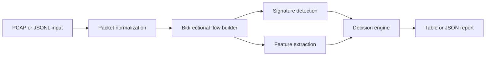

# CryptoFlow Agent


CryptoFlow Agent is a defensive, open-source Python agent for encrypted traffic detection and lightweight protocol identification. It groups packets into bidirectional flows, extracts explainable features, and labels common encrypted protocols such as TLS, QUIC, and SSH.

> Scope: this project is for blue-team monitoring, research, asset inventory, and traffic observability. It does **not** decrypt traffic, bypass encryption, steal secrets, or perform offensive exploitation.

## Features

- Detects common encrypted traffic with protocol signatures:
  - TLS record headers and TLS-like ports
  - QUIC long headers over UDP
  - SSH banners and SSH-like ports
- Uses explainable flow heuristics for unknown encrypted traffic:
  - payload entropy
  - printable byte ratio
  - packet and payload size statistics
- Accepts classic `.pcap` files with a built-in lightweight parser.
- Accepts `.jsonl` packet summaries for easy integration with Zeek, custom taps, or data pipelines.
- Accepts Suricata EVE JSONL via `--format eve`.
- Extracts TLS ClientHello metadata when present, including SNI, ALPN, and supported versions.
- Emits human-readable tables or JSON.
- Has no mandatory runtime dependencies.

## Installation

```bash
python -m pip install git+https://github.com/koppx/cryptoflow-agent.git
```

For local development from a clone:

```bash
python -m pip install -e .
```

## Quick start

```bash
python -m pip install -e .
cryptoflow-agent examples/sample_packets.jsonl --format jsonl
cryptoflow-agent examples/sample_packets.jsonl --format jsonl --output json
```

Example output:

```text
encrypted  protocol           confidence flow
----------------------------------------------
True       tls                0.95       TCP 10.0.0.2:53120 <-> 93.184.216.34:443
  - TLS record header observed
  - well-known TLS port observed
False      unknown            0.00       TCP 10.0.0.4:52000 <-> 10.0.0.5:80
  - no encrypted protocol signature or strong entropy signal observed
```

## Useful CLI options

```bash
# JSON output
cryptoflow-agent examples/sample_packets.jsonl --format jsonl --output json

# CSV output
cryptoflow-agent examples/sample_packets.jsonl --format jsonl --output csv

# Suricata EVE JSONL
cryptoflow-agent examples/sample_eve.jsonl --format eve --output json

# Show only encrypted flows above a confidence threshold
cryptoflow-agent examples/sample_packets.jsonl --format jsonl --only-encrypted --min-confidence 0.8

# Read JSONL from stdin
cat examples/sample_packets.jsonl | cryptoflow-agent - --format jsonl
```

## JSONL input format

Each line is one packet-like event:

```json
{"timestamp": 1.0, "src_ip": "10.0.0.2", "src_port": 53120, "dst_ip": "93.184.216.34", "dst_port": 443, "protocol": "TCP", "payload_encoding": "hex", "payload": "160303002e0100"}
```

Fields:

- `timestamp`: seconds as float or int
- `src_ip`, `src_port`, `dst_ip`, `dst_port`
- `protocol`: `TCP` or `UDP`
- `payload`: text by default, or hex when `payload_encoding` is `hex`
- `size`: optional on-wire packet size

## Python API

```python
from cryptoflow_agent import CryptoFlowAgent, Packet

packets = [
    Packet(
        timestamp=1.0,
        src_ip="10.0.0.2",
        src_port=53000,
        dst_ip="93.184.216.34",
        dst_port=443,
        protocol="TCP",
        payload=b"\x16\x03\x03\x00\x2e" + b"x" * 80,
    )
]

agent = CryptoFlowAgent()
for result in agent.analyze_packets(packets):
    print(agent.explain(result))
```

## Architecture




## Maintenance automation

This repository includes weekly maintenance automation:

- `.github/workflows/weekly-maintenance.yml` runs lint, tests, and CLI smoke checks every Monday.
- `.github/dependabot.yml` checks Python and GitHub Actions dependencies weekly.
- See `docs/maintenance.md` for the weekly review checklist and optimization backlog.

## Repository checklist before publishing

- Enable GitHub Actions.
- Configure a private vulnerability reporting contact in GitHub Security settings.
- Add sanitized examples only; never commit private captures.

## Roadmap

- Add PCAPNG support.
- Add IPv6, VLAN, and fragmented IPv4 support in the built-in parser.
- Add optional integrations for Scapy, Zeek logs, and Suricata EVE JSON.
- Add supervised ML model training for organization-specific protocol families.
- Add JA3/JA4-style TLS fingerprint extraction when full handshakes are available.
- Add streaming mode for live packet/event ingestion.

## Development

```bash
python -m pip install -e '.[dev]'
ruff check src tests
pytest -q
```

## Responsible use

Only run CryptoFlow Agent on networks, captures, and systems you own or are authorized to monitor. Treat packet captures as sensitive data: they can contain metadata, credentials in plaintext protocols, internal hostnames, and personal information.

## License

MIT
